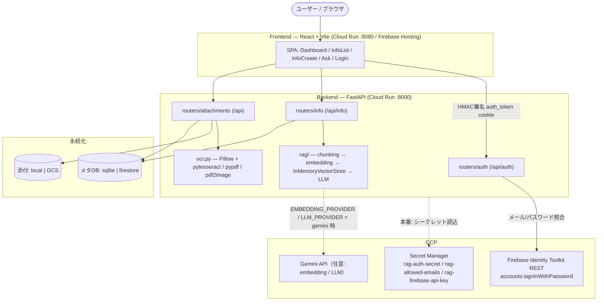

# 保育園情報アシスタント MVP (Toddler Private RAG)

保育園から提供される膨大な情報（お手紙、掲示、行事予定など）を一元管理し、必要な情報を素早く
確認するためのプライベートRAGアシスタントです。登録した情報・添付資料のOCRテキストを
ベクトル検索し、LLMで質問に回答します。プライベートデータを扱うため、認証とSecret管理を前提に
設計されています。

## 主な機能

- **ダッシュボード**: 明日の持ち物、今週の行事、未対応の提出物をクイックビュー
- **情報一覧**: キーワード・種別・ステータスによる検索／フィルタリング
- **情報登録**: 新しい情報の登録と添付ファイル（画像/PDF）のアップロード（OCR連携）
- **RAG（ベクトル検索＋LLM回答生成）**: 埋め込みベースのベクトル検索で関連情報を取得し、
  LLMで質問に回答（出典チャンク付き）

## アーキテクチャ



## データフロー（取り込み → 検索 → 回答）

```mermaid
flowchart LR
    subgraph Ingest["① 取り込み"]
        A1["POST /api/info<br/>NurseryInfo 作成"]
        A2["POST /api/info/{id}/attachments<br/>ファイル保存 (local/GCS)"]
        A3["ocr.extract_text<br/>OCRテキスト抽出"]
        A4[("Attachment.ocr_text 保存<br/>sqlite/firestore")]
        A1 --> A2 --> A3 --> A4
    end

    subgraph Index["② 索引"]
        B1["get_rag_service(repo)<br/>repo.list() 全info取得"]
        B2["chunking.build_documents<br/>title/content + OCR を chunk_size=500 / overlap=50"]
        B3["EmbeddingProvider.embed<br/>(fake | gemini)"]
        B4["InMemoryVectorStore<br/>（リクエスト毎に構築）"]
        B1 --> B2 --> B3 --> B4
    end

    subgraph Query["③ 検索・回答"]
        C1["クエリ埋め込み"]
        C2["コサイン類似度で top_k チャンク取得"]
        C3["LLMProvider.generate(query, contexts)"]
        C4["{answer, sources[]} 返却<br/>出典ラベル付き"]
        C1 --> C2 --> C3 --> C4
    end

    A4 --> B1
    B4 --> C1
```



- **① 取り込み (Ingest)**: `POST /api/info` で情報レコード（`NurseryInfo`）を作成。
  `POST /api/info/{id}/attachments` で画像/PDFを保存（`STORAGE_BACKEND`=local|gcs）し、
  `ocr.extract_text` がOCRテキストを抽出して `Attachment.ocr_text` に保存します。
  - 画像: Pillow + pytesseract（`jpn+eng`、データ欠如時は既定言語へフォールバック）
  - PDF: pypdf の埋め込みテキストを優先し、無ければ pdf2image + pytesseract でOCR
- **② 索引 (Index)**: `get_rag_service(repo)` が `repo.list()` で全情報を取得し、
  `chunking.build_documents` でタイトル/本文（source=`content`）と添付OCRテキスト（source=`ocr`）を
  `chunk_size=500` / `overlap=50` でチャンク化。`EmbeddingProvider.embed` で埋め込み、
  インプロセスの `InMemoryVectorStore`（純Pythonのコサイン類似度）へ格納します。
  ベクトルストアはリクエストごとに構築されるため追加インフラは不要です。
- **③ 検索 (Search)**: `GET /api/info/search?q=...&top_k=4` はベクトル検索のみを行い、
  関連チャンク（出典）を返します。
- **③ 回答 (Answer)**: `POST /api/info/ask`（`{"query": "...", "top_k": 4}`）は検索結果を
  コンテキストに `LLMProvider.generate` で回答を生成し、`{"answer": "...", "sources": [...]}`
  を返します。OCR由来の出典は `タイトル（添付: ファイル名）` というラベルになります。
- すべてのエンドポイントは認証必須です（HMAC署名された `auth_token` cookie を検証）。

## 技術スタック

| レイヤ | 技術 |
|--------|------|
| Frontend | React 19 + TypeScript, Vite, Tailwind CSS, TanStack Query, React Router |
| Backend | FastAPI (Python 3.12), SQLAlchemy, SQLite |
| OCR | pytesseract, pypdf, pdf2image, Pillow（ローカル実行） |
| RAG | インプロセス・ベクトルストア（コサイン類似度）+ Provider抽象（fake / gemini） |
| GCP | Cloud Run, Cloud Build, Secret Manager、（任意）Cloud Storage / Firestore / Gemini API |
| 認証 | Firebase Identity Toolkit REST（サーバサイド照合）+ HMAC署名セッションcookie |

## RAG（ベクトル検索＋LLM回答生成）

登録情報（タイトル・本文・添付のOCRテキスト）をチャンク化して埋め込み、コサイン類似度で
関連チャンクを検索し、その結果をコンテキストにLLMで回答を生成します。

### エンドポイント（要認証）

- `POST /api/info/ask` — `{"query": "...", "top_k": 4}` → `{"answer": "...", "sources": [...]}`
- `GET /api/info/search?q=...&top_k=4` — ベクトル検索のみ（出典チャンクを返す）

### Provider 設定（環境変数）

- `EMBEDDING_PROVIDER` / `LLM_PROVIDER`: `fake`（既定）| `gemini`
- 既定の `fake` は決定論的でAPIキー不要。オフラインで動作し、テストにも使用します。
- `gemini` を使う場合は `GEMINI_API_KEY`（または `GOOGLE_API_KEY`）を設定し、
  `google-generativeai` をインストールしてください（SDKは遅延インポートのため未導入でも起動は可能）。
- ベクトルストアはインプロセス（純Pythonのコサイン類似度）で追加インフラ不要。
  `sqlite` / `firestore` いずれのメタデータバックエンドでも動作します。

## セットアップ（ローカル）

事前に `.env.example` をコピーして `.env` を作成し、必要な変数を設定してください
（→ [環境変数一覧](#環境変数一覧)）。

### バックエンド

```bash
cd backend
python -m venv venv
source venv/bin/activate        # Windows: venv\Scripts\activate
pip install -r requirements.txt
uvicorn app.main:app --reload
```

- API: http://localhost:8000
- API ドキュメント (Swagger UI): http://localhost:8000/docs
- ヘルスチェック: http://localhost:8000/health

### フロントエンド

```bash
cd frontend
npm install
npm run dev
```

- 開発サーバー: http://localhost:5173 (Vite)

### Docker（任意）

```bash
# docker compose（backend を :8000 で起動、./backend/data をマウント）
docker compose up

# もしくは個別ビルド
docker build -t toddler-private-rag-backend ./backend
docker run -p 8000:8000 --env-file .env toddler-private-rag-backend

docker build -t toddler-private-rag-frontend ./frontend
docker run -p 8080:8080 toddler-private-rag-frontend
```

## 環境変数一覧

`.env.example` を参照のうえ `.env` に設定します（本番のシークレットは Secret Manager 管理を推奨）。

| 変数名 | 説明 | 既定・例 |
|--------|------|----------|
| `APP_ENV` | 実行環境。`production` で cookie secure 有効・起動時 seed 無効 | `local` |
| `FIREBASE_API_KEY` | Firebase Web API key。backend がサーバサイドREST認証に使用（本番は `rag-firebase-api-key`） | `your-firebase-web-api-key` |
| `ALLOWED_USER_EMAILS` | ログインを許可するメール（カンマ区切り、本番は Secret Manager 推奨） | `you@example.com` |
| `AUTH_SECRET` | セッションcookie署名シークレット（32文字以上推奨、本番は `rag-auth-secret`） | `your-random-secret-key-here` |
| `GOOGLE_CLOUD_PROJECT` | Firebase Admin / GCP プロジェクトID | `your-gcp-project-id` |
| `CORS_ORIGINS` | 許可するフロントエンドOrigin（カンマ区切り） | `http://localhost:5173` |
| `GCP_PROJECT_ID` | デプロイ対象のGCPプロジェクトID | `your-gcp-project-id` |
| `GCP_REGION` | Cloud Run リージョン | `asia-northeast1` |
| `CLOUD_RUN_SERVICE_NAME` | backend の Cloud Run サービス名 | `toddler-private-rag-backend` |
| `ARTIFACT_REGISTRY_REPOSITORY` | Artifact Registry リポジトリ名 | `toddler-rag-registry` |
| `IMAGE_NAME` | backend コンテナイメージ名 | `toddler-private-rag-backend` |
| `STORAGE_BACKEND` | 添付ファイル保存先 | `local` / `gcs` |
| `GCS_BUCKET_NAME` | `gcs` 利用時のバケット名 | `your-gcs-bucket-name` |
| `DATABASE_TYPE` | メタデータ永続化先 | `sqlite` / `firestore` |
| `FIRESTORE_DATABASE` | Firestore データベース名 | `(default)` |
| `EMBEDDING_PROVIDER` | 埋め込みプロバイダ | `fake`（既定）/ `gemini` |
| `LLM_PROVIDER` | 回答生成プロバイダ | `fake`（既定）/ `gemini` |
| `GEMINI_API_KEY` | `gemini` プロバイダ利用時のみ必要（`GOOGLE_API_KEY` でも可） | （未設定） |

> 注: フロントエンド用 Firebase 設定が必要な構成では `VITE_FIREBASE_*` をフロントのビルド環境に設定します。

## 認証

このアプリは **Firebase（メール/パスワード）+ 署名付きセッションcookie** を使用します。
ブラウザは Firebase と直接通信せず、backend が Identity Toolkit REST
（`accounts:signInWithPassword`）でメール/パスワードを照合します。照合後、HMAC署名された
`auth_token` cookie を発行し、以降のAPIアクセスを認可します。
ログインしたメールアドレスが `ALLOWED_USER_EMAILS` に含まれている場合のみアクセスが許可されます。

## GCP デプロイ

Cloud Run（Backend :8000 / Frontend :8080）にデプロイできます。

### 1. Secret Manager のシークレット作成（初回のみ）

```bash
# セッション署名シークレット
echo -n "your-random-32+chars" | gcloud secrets create rag-auth-secret --data-file=- --project=YOUR_PROJECT_ID

# 許可メールアドレス
echo -n "you@example.com,other@example.com" | gcloud secrets create rag-allowed-emails --data-file=- --project=YOUR_PROJECT_ID

# Firebase Web API key（サーバサイドREST認証用）
echo -n "your-firebase-web-api-key" | gcloud secrets create rag-firebase-api-key --data-file=- --project=YOUR_PROJECT_ID

# Cloud Run サービスアカウントへ secretAccessor 権限を付与
gcloud projects add-iam-policy-binding YOUR_PROJECT_ID \
  --member="serviceAccount:YOUR_PROJECT_NUMBER-compute@developer.gserviceaccount.com" \
  --role="roles/secretmanager.secretAccessor"
```

### 2. デプロイ

```bash
GCP_PROJECT_ID=your-project-id bash scripts/deploy-cloudrun.sh
```

スクリプトは Cloud Build で backend / frontend をビルドし、Cloud Run にデプロイします。
backend は `APP_ENV=production`（cookie secure 有効・起動時 seed 無効）で起動し、
シークレットは Secret Manager から注入されます。

### データ永続化について

ローカルでは SQLite + ローカルファイル保存が既定です。Cloud Run はステートレスなため、
本番の永続化には `DATABASE_TYPE=firestore`（メタデータ）と `STORAGE_BACKEND=gcs` +
`GCS_BUCKET_NAME`（添付ファイル）を使用します。

## プライバシー・セキュリティ

- 保育園資料・個人メモなどのプライベートデータを外部に送信しないこと。
- 外部 LLM API（`gemini` プロバイダ等）を使用する場合はデータ送信範囲を確認すること。
- 実データなしでもデプロイ準備状態を確認できます（空の状態でも起動可能）。
- 本番環境（`APP_ENV=production`）では、起動時のサンプルデータ投入（seed）は行われません。
- 実際の `.env` は Git 管理対象外（`.gitignore` 設定済み）。個人情報・保育園資料はコードに直書きしないこと。
