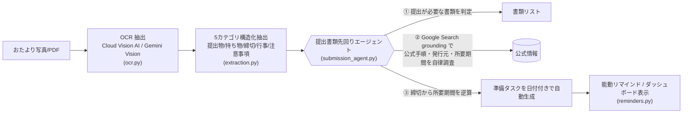
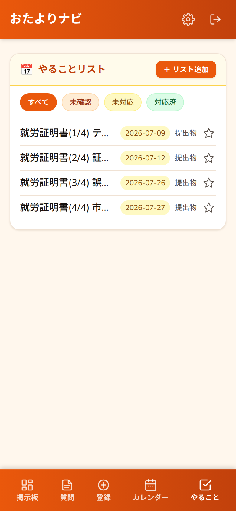
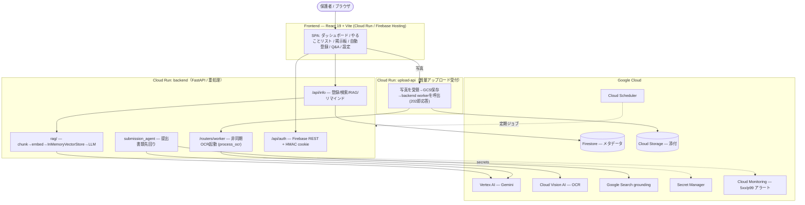
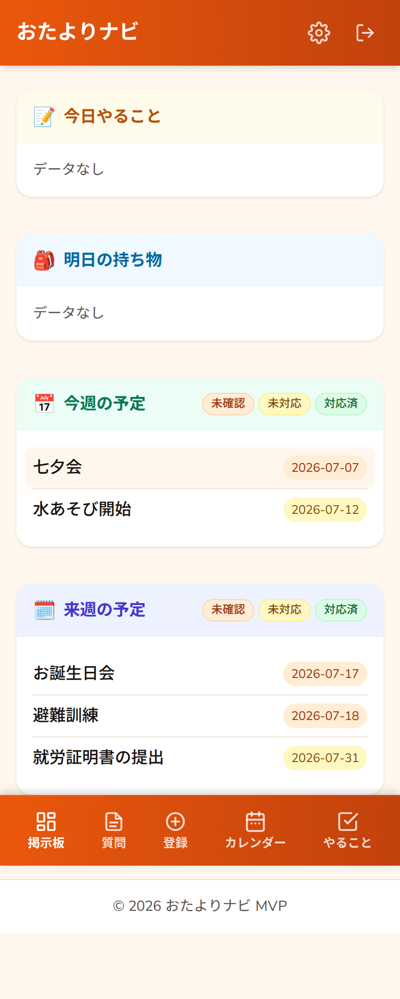
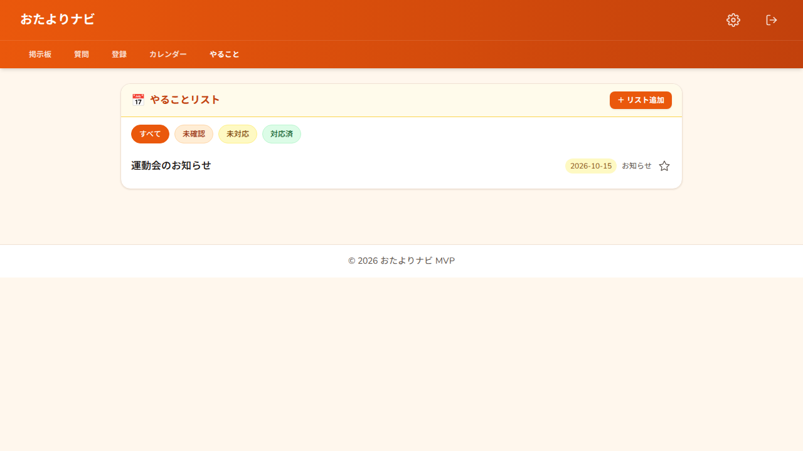
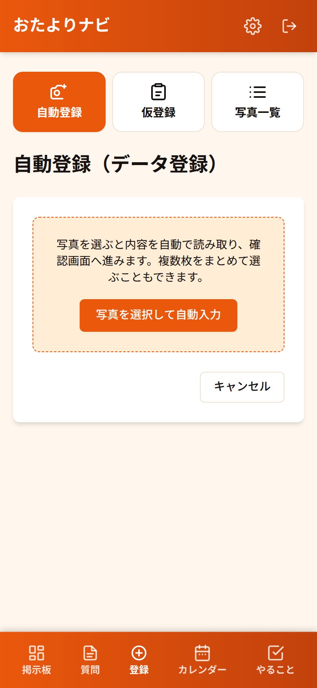
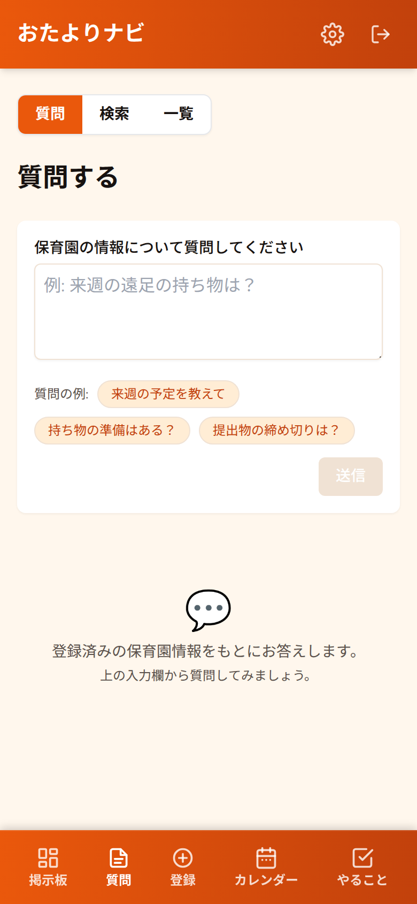
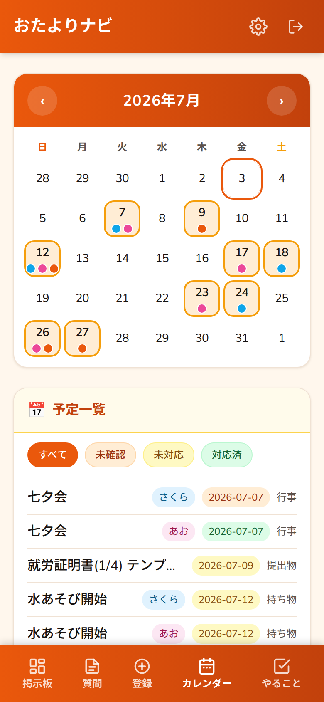
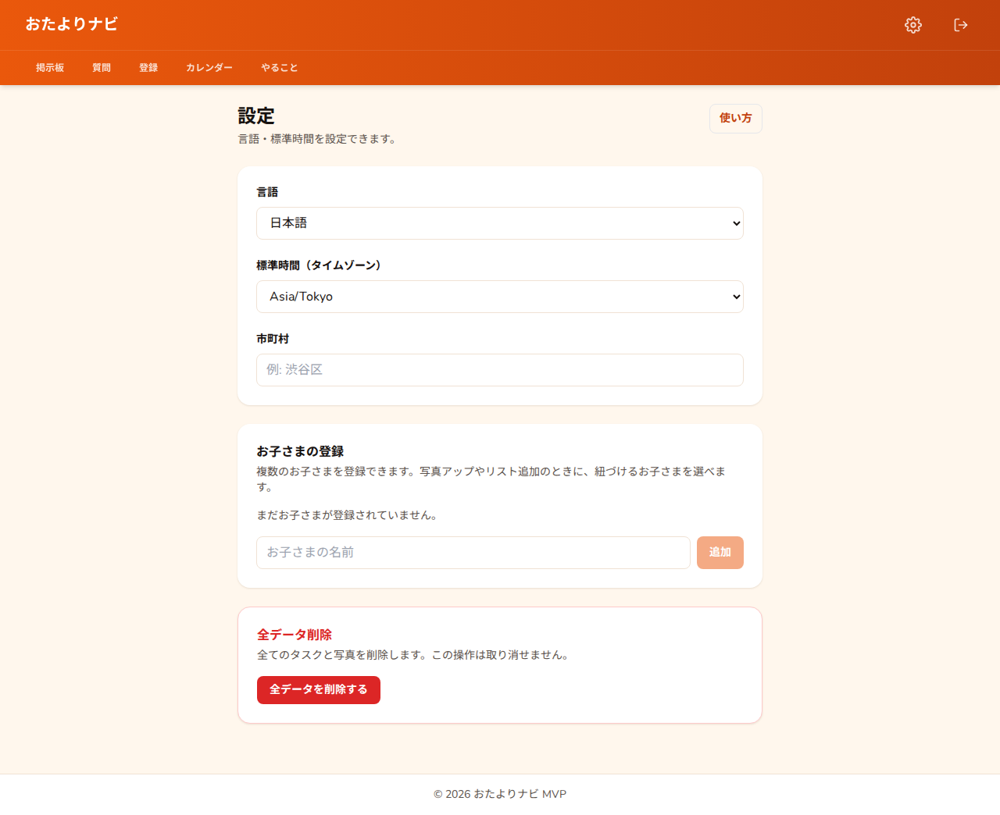

# おたよりナビ — 保育園おたよりを「撮るだけ」で先回りする自律AIエージェント

> 保育園から届く大量の紙・掲示・行事案内を **写真に撮って登録するだけ**。
> AIエージェントが OCR → 情報の構造化 → **公式手順の自律調査** → **締切から逆算した準備タスクの自動生成**
> までを一気通貫で実行する、**提出物を先回りする**家庭向けプライベート AI エージェントです。
> 具体的には、**おたよりの1文から、AI が提出書類を判定し、公式手順を調べ、発行リードタイムを見積もり、
> 準備開始日を逆算してタスク化**します。
> （RAG は根拠付き回答を支える内部基盤として活用しつつ、中核はおたよりを起点に
> **自律的に調べ・逆算し・準備タスクを先回りで生成する**エージェントです。）

**Findy DevOps AI Agent Hackathon 提出作品**
Google Cloud（Cloud Run / Vertex AI Gemini / Cloud Vision AI）上で、Terraform による IaC・
Workload Identity Federation による CI/CD・Cloud Monitoring まで含めたフルサイクルで運用しています。

- 🚀 **ライブデモ**: <https://toddler-private-rag-frontend-iqrm6wvhfq-an.a.run.app/tasks>
- 🎥 **紹介動画**: <https://www.youtube.com/channel/UC8u73I1rt1L3b4L5ZVfo-Ng>
- 🖼️ **デモ画面**: 本 README のスクリーンショット（[7. スクリーンショット（UI/UX）](#7-スクリーンショットuiux)）と[締切逆算の実例（就労証明書）](#21-実例-就労証明書の準備を読む--調べる--逆算まで自動化)を参照してください。

---

## 1. 課題 / 背景 / 対象ユーザー / 提供価値

### 課題
保育園からの情報は「紙のおたより・玄関の掲示・行事予定表」など**非構造・非デジタル**で大量に届きます。
提出物・持ち物・締切・行事が各所に散らばり、保護者は毎回それを読み解き、
「この書類は勤務先発行か？」「発行に何日かかる？」「いつ準備を始めれば締切に間に合う？」を
**手作業で調べて逆算**する必要があります。共働き世帯ではこの認知負荷が積み重なり、提出漏れ・締切超過の
原因になります。

### 対象ユーザー
- 共働き・多忙で、園からの情報を追いきれない保護者
- 紙とデジタルが混在し、情報が一元化されていない家庭

### 提供価値
- **撮って登録するだけ**：写真/PDF を上げれば、AI が提出物・持ち物・締切・行事・注意事項を自動抽出。
- **先回りしてくれる**：提出書類について公式手順・発行元・所要期間を **AI が自律的に調べ**、
  締切から逆算した**準備タスク**を日付付きで自動生成。
- **迷わない UI**：今日/明日の持ち物、今週/来週の行事、未対応の提出物をダッシュボードで即確認。
  自然文で質問すれば、登録情報を根拠（出典）付きで回答。

---

## 2. なぜ「AIエージェント」なのか（必然性）

本作品は単なるチャットボットではありません。**人間が毎回行っていた多段の判断・調査・逆算を、
エージェントが自律的に実行**します。中核は提出書類先回りエージェント
（`backend/app/submission_agent.py`）です。



エージェントが自律的に行う判断・実行:

1. **抽出判断** — OCR テキストから「提出が必要な書類」を LLM で判定（暴走防止に上限つき）。
2. **自律調査** — 各書類について **Google Search grounding** で公式手順・勤務先/会社発行の要否・
   標準的な所要期間を調べる（利用不可時は LLM の既知知識へ graceful fallback、例外を伝播させない設計）。
3. **逆算実行** — 提出期限から所要期間を差し引いた**準備開始日**を計算し、日付付き準備タスクを生成。
   以降は能動リマインドが緊急度別に通知します。

> 「読む → 調べる → 逆算する」という人手の一連作業をエージェントが肩代わりすること自体が価値であり、
> ここに **AIエージェントである必然性** があります。

### 2.1 実例: 就労証明書の準備を「読む → 調べる → 逆算」まで自動化

**Before（保護者が受け取るおたより 1 行）:**

> 保育を必要とする状況の確認のため、**就労証明書を 2026/7/30 までにご提出ください。**

**エージェントの自律処理:**

1. **抽出** — OCR テキストから「保護者が提出すべき書類」を LLM で判定 → `就労証明書`（期限 2026-07-30）。
2. **自律調査（Google Search grounding）** — 公式手順・発行元・所要期間を調べる → 手順は
   `テンプレート入手(約3日)` → `証明書発行（勤務先へ依頼, 約14日）` → `誤り確認(約1日)` → `市町村に提出(約3日)`。
3. **逆算実行** — 最終締切 2026-07-30 から各手順の所要期間を後ろ向きに差し引き、**準備タスクを日付付きで自動生成**。

**After（自動生成された準備タスク）:**

| # | 準備タスク | 生成された締切 |
|---|---|---|
| 1/4 | 就労証明書 テンプレート入手 | 2026-07-09 |
| 2/4 | 就労証明書 証明書発行（勤務先へ依頼） | 2026-07-12 |
| 3/4 | 就労証明書 誤り確認 | 2026-07-26 |
| 4/4 | 就労証明書 市町村に提出 | 2026-07-27 |

|  | **実例** — 締切逆算で自動生成された準備タスク（やることリスト） |
|---|---|

> 「7/30 提出」という 1 行のおたよりから、発行に約 2 週間かかる書類の**準備開始日（7/9）まで逆算**して
> タスク化しています。この逆算ロジックは `backend/tests/test_submission_agent.py`
> （`test_build_drafts_per_step_backward_chain`）で検証済みで、上記の日付はテストで固定された生成結果と一致します。

### 2.2 設計判断: ADK/Agent Builder ではなく Vertex AI 上の自前 in-process 実装

エージェント基盤として **ADK / Agent Builder / Agent Engine** も検討しましたが、本エージェントの処理は
「OCR → 抽出 → Google Search grounding → 締切逆算」という**確定的で短いパイプライン**です。多エージェントの
動的オーケストレーションや外部ツール群の呼び出しを必要としないため、**軽量・低レイテンシ・依存最小**を優先し、
Vertex AI（`google-genai` SDK, `GOOGLE_GENAI_USE_VERTEXAI`）上の **in-process 実装**を採用しました
（設計決定は `backend/app/submission_agent.py` 冒頭に「決定1=案A」として明記）。自律調査の中核である
**Google Search grounding は Vertex AI Gemini の機能**として利用しており、GCP AI 技術の必須要件は充足しています。
将来的に多エージェント化や外部ツール連携が必要になった場合は、この境界を保ったまま ADK / Agent Engine へ
移行できる構成です。

---

## 3. 主な機能

- **ダッシュボード / 掲示板**: 今日・明日の持ち物、今週・来週の行事、未対応の提出物をクイックビュー
  （`GET /api/info/today` / `tomorrow` / `weekly` / `next-week` / `pending`）
- **提出書類先回りエージェント**: 提出書類の公式手順を自律調査し、締切逆算の準備タスクを自動生成
  （`backend/app/submission_agent.py`）
- **自動登録（OCR）**: 写真/PDF を OCR・構造化して登録フォームのドラフトを自動生成（`POST /api/info/extract`）。
  仮登録（`GET /api/info/drafts`）→ 本登録（`POST /api/info/{id}/finalize`）
- **能動リマインド**: 締切・行事の緊急度別リマインドとダイジェスト（`GET /api/info/reminders` / `reminders/digest`）
- **RAG Q&A**: 登録情報・添付OCRテキストをベクトル検索し、LLM が**出典（sources）付き**で回答
  （`POST /api/info/ask`、Markdown整形表示）
- **ハイブリッド検索 / AI自動タグ付け**: キーワード＋ベクトル＋ファセット統合検索（`GET /api/info/hybrid-search`）、
  内容からタグ候補生成（`POST /api/info/suggest-tags`）
- **お気に入り / 編集・削除**: やることリスト・掲示板でのお気に入り表示、レコード編集（`PUT /api/info/{id}`）・
  削除（`DELETE /api/info/{id}`）
- **ユーザー単位のデータ分離**: メールから導出した owner 単位で情報を分離し、他ユーザーのデータに触れない
  （`backend/app/identity.py`）
- **日本語 / 英語 切替**、JST 統一の日付計算

---

## 4. Google Cloud 必須要件の充足（審査用マッピング）

| 必須要件 | 使用プロダクト | 用途 | 実装根拠 |
|---|---|---|---|
| **アプリ実行プロダクト（1つ以上）** | **Cloud Run** | backend（重処理API）と `upload-api`（軽量アップロード受付）の**2サービス構成** | `infra/terraform/cloud_run.tf` / `cloud_run_upload.tf`, `backend/upload_function/`, `.github/workflows/deploy-cloudrun.yml` |
| | Cloud Build / Artifact Registry | コンテナのビルド・格納 | `scripts/deploy-cloudrun.sh`, `infra/terraform/artifact_registry.tf` |
| | Cloud Scheduler | 孤児ファイルの定期パージ等の自律ジョブ | `infra/terraform/scheduler.tf` |
| **AI 技術（1つ以上）** | **Vertex AI 上の Gemini** | 構造化抽出・RAG回答生成・提出書類調査（`google-genai` SDK, Vertex モード） | `backend/app/ai_client.py`（`GOOGLE_GENAI_USE_VERTEXAI`）, `extraction.py`, `rag/providers.py` |
| | **Cloud Vision AI** | 画像おたよりの OCR | `backend/app/ocr.py`（`google-cloud-vision`, `OCR_PROVIDER=vision`） |
| | **Google Search grounding** | 提出書類の公式手順・所要期間の自律調査 | `backend/app/submission_agent.py` |

> ローカル/テストでは API キー不要の `fake` プロバイダで決定論的に動作し、本番では Vertex AI へ切替。
> OCR は Vision AI / Gemini Vision を優先し、未設定時は pytesseract / pypdf へ graceful fallback します。

---

## 5. アーキテクチャ



**非同期取り込み**: 軽量 `upload-api` が写真を GCS に保存して backend の worker を呼び、
worker は 202 を即返して背景で `process_ocr`（OCR→構造化→エージェント）を実行します。
アップロード体験をブロックしない、実運用志向の構成です。

---

## 6. DevOps フルサイクル

デプロイまでを見据え、Infrastructure as Code・CI/CD・サプライチェーン検査・監視まで整備しています。

- **IaC (Terraform)** — `infra/terraform/`（17ファイル）で GCP をコード管理:
  Cloud Run ×2（`cloud_run.tf` / `cloud_run_upload.tf`）、Firestore、Pub/Sub、Cloud Storage、
  Secret Manager、IAM、**Workload Identity Federation**（`wif.tf`）、Artifact Registry、
  Cloud Scheduler、Cloud Monitoring（アラート `monitoring.tf` / ダッシュボード `dashboard.tf`）、API 有効化。
  Terraform state は **GCS リモートバックエンド**（`versions.tf` の `backend "gcs"`）で共有・永続化します。
- **CI** (`.github/workflows/ci.yml`) — 3 ジョブ構成: `backend-tests`（`pytest` +
  **カバレッジゲート** `--cov-fail-under=70`）、`evaluation-gate`（後述のエージェント性能評価ゲート）、
  `frontend-checks`（`eslint` + `typecheck/build` + **Playwright e2e**）。
- **エージェント性能評価ゲート** (`evaluation-gate`) — おたより先回りエージェント（OCR→抽出→RAG）の
  **精度回帰を独立した必須ステータスチェック**として分離（`backend/tests/test_eval_ocr.py` /
  `test_eval_rag.py`、golden dataset は `backend/tests/eval/dataset.py`）。閾値を割ると CI が落ち、
  **CD（deploy-cloudrun）は CI 成功がゲート**のため本番デプロイもブロックされます。ゲートする指標:
  - **OCR 精度** — 日付・持ち物の coverage（recall）に加え、**precision（誤検出ゼロ）** と **F1** を
    集約平均で下限ゲート。
  - **RAG 精度** — **top-source 正答率**・**keyword hit rate**・**groundedness**（回答語が取得ソースに
    追跡可能か）・**refusal**（空インデックス時は出典なし＋拒否応答を返す）を下限ゲート。
- **CD** (`.github/workflows/deploy-cloudrun.yml`) — **CI 成功を条件**に起動（`workflow_run`）し、
  **変更のあったサービスのみ**を Docker build → Artifact Registry push → Cloud Run deploy。
  backend は **canary デプロイ**（`--no-traffic --tag canary` で無トラフィック投入 → `/health`
  チェック → 合格で 100% 昇格 / 失敗で旧リビジョン維持の**自動ロールバック**）。
  認証は **Workload Identity Federation**（JSON キーレス、`id-token: write`）。
- **Terraform CI** (`.github/workflows/terraform-ci.yml`) — `infra/terraform/**` 変更時に
  `fmt -check` / `init -backend=false` / `validate` で IaC を静的検証。
- **サプライチェーン検査** (`.github/workflows/security-scan.yml`) — `pip-audit`・`npm audit`・
  **Trivy**（依存脆弱性スキャン + IaC/Dockerfile ミス設定は CRITICAL でブロッキング）・
  **SBOM 生成**（CycloneDX）。依存更新は **Dependabot**（`.github/dependabot.yml`）で自動 PR 化。
- **監視** — `infra/terraform/monitoring.tf` で Cloud Run の **5xx エラー率**・**p99 レイテンシ**・
  **LLM エラー**（ログベースメトリクス）にアラートポリシー、`dashboard.tf` で運用ダッシュボードを
  Terraform 定義。運用手順は `docs/runbook-operations.md` / `docs/runbook-rollback.md` を参照。
- **設計判断の記録 (ADR)** — 主要な設計判断を `docs/adr/` に Architecture Decision Record として記録
  （in-process エージェント / 自前 RAG / never-throw 劣化 / Firestore+SQLite 永続化）。
- **シークレット管理** — セッション署名鍵・許可メール・Firebase API key・worker トークンを
  Secret Manager から `--set-secrets` で注入。

### 実績（数値）

| 項目 | 実績 |
|---|---|
| 自動テスト（backend） | **pytest 284 件**（`backend/tests/`）、CI でカバレッジゲート（`--cov-fail-under=70`）＋**エージェント性能評価ゲート**（OCR precision/F1・RAG groundedness/refusal を独立チェックで回帰ゲート） |
| 自動テスト（frontend E2E） | **Playwright 19 テスト / 4 spec**（`frontend/e2e/`） |
| Infrastructure as Code | **Terraform 17 ファイル**（`infra/terraform/`）、state は GCS リモートバックエンドで永続化 |
| CI / CD | GitHub Actions 4 ワークフロー（`ci.yml` / `deploy-cloudrun.yml` / `terraform-ci.yml` / `security-scan.yml`）、**Workload Identity Federation**（キーレス認証）、CD は CI 成功をゲートに canary デプロイ + 自動ロールバック |
| サプライチェーン | `pip-audit` / `npm audit` / **Trivy**（依存 + IaC ミス設定）/ **SBOM**（CycloneDX）/ **Dependabot** 自動更新 |
| 監視 | Cloud Monitoring に **5xx エラー率**・**p99 レイテンシ**・**LLM エラー**の**アラートポリシー**＋運用**ダッシュボード**を Terraform 定義（`monitoring.tf` / `dashboard.tf`） |

> 数値は実際のテスト収集数・ファイル数に基づきます。監視は「アラートポリシー／ダッシュボードを
> IaC で定義済み」という意味で、実測 SLO 値ではありません。サプライチェーン検査は初期展開時の
> 破綻を避けるため、Trivy の IaC ミス設定のみブロッキング、依存監査はレポーティング運用です。

---

## 7. スクリーンショット（UI/UX）

| 画面 | 説明 |
|---|---|
|  | **掲示板 / ダッシュボード** — 今日・明日・今週・来週を一目で把握 |
|  | **やることリスト** — 提出物・持ち物をステータス管理、お気に入り表示 |
|  | **自動登録** — 写真を上げるだけで AI が下書きを生成 |
|  | **AI Q&A** — 自然文の質問に、登録情報を出典付きで回答 |
|  | **予定** — 行事・締切をカレンダー的に確認 |
|  | **設定** — 言語切替・各種設定、アプリの使い方ガイド |

---

## 8. 技術スタック

| レイヤ | 技術 |
|--------|------|
| Frontend | React 19 + TypeScript, Vite, Tailwind CSS, TanStack Query, React Router 7 |
| Backend | FastAPI (Python 3.12), SQLAlchemy, SQLite（local）/ Firestore（本番） |
| AI エージェント | 提出書類先回りエージェント（`submission_agent.py`）+ Google Search grounding |
| OCR | Cloud Vision AI / Gemini Vision（優先）→ pytesseract / pypdf / pdf2image / Pillow にフォールバック |
| RAG | インプロセス・ベクトルストア（純Pythonコサイン類似度）+ Provider抽象（fake / gemini） |
| AI | `google-genai` 経由の Gemini。本番は Vertex AI（`GOOGLE_GENAI_USE_VERTEXAI=true`）、ローカルは APIキーも可 |
| GCP | Cloud Run ×2, Cloud Build, Artifact Registry, Secret Manager, Firestore, Cloud Storage, Cloud Scheduler, Cloud Monitoring, Vertex AI, Vision AI |
| IaC / CI/CD | Terraform（GCS リモート state）, GitHub Actions（CI / CD / Terraform CI / Security Scan、Workload Identity Federation、canary デプロイ + 自動ロールバック） |
| セキュリティ | pip-audit / npm audit / Trivy（依存 + IaC ミス設定）/ SBOM（CycloneDX）/ Dependabot |
| 認証 | Firebase Identity Toolkit REST（サーバサイド照合）+ HMAC署名セッションcookie |

---

## 9. セットアップ（ローカル）

事前に `.env.example` をコピーして `.env` を作成し、必要な変数を設定してください
（→ [環境変数一覧](#11-環境変数一覧)）。ローカルは既定の `fake` プロバイダで API キー不要・オフライン動作します。

### バックエンド

```bash
cd backend
python -m venv venv
source venv/bin/activate        # Windows: venv\Scripts\activate
pip install -r requirements.txt
uvicorn app.main:app --reload
```

- API: http://localhost:8000 ／ Swagger UI: http://localhost:8000/docs ／ ヘルスチェック: http://localhost:8000/health

### フロントエンド

```bash
cd frontend
npm install
npm run dev     # http://localhost:5173 (Vite)
```

### Docker（任意）

```bash
docker compose up   # backend を :8000 で起動、./backend/data をマウント
```

---

## 10. RAG（ベクトル検索＋LLM回答生成）

登録情報（タイトル・本文・添付のOCRテキスト）をチャンク化して埋め込み、コサイン類似度で
関連チャンクを検索し、その結果をコンテキストにLLMで回答を生成します。ベクトルストアは
インプロセス（純Pythonのコサイン類似度）でリクエスト毎に構築するため、追加インフラは不要です。

### エンドポイント（要認証）

- `POST /api/info/ask` — `{"query": "...", "top_k": 4}` → `{"answer": "...", "sources": [...]}`
- `GET /api/info/search?q=...&top_k=4` — ベクトル検索のみ（出典チャンクを返す）

### Provider 設定（環境変数）

- `EMBEDDING_PROVIDER` / `LLM_PROVIDER`: `fake`（既定, APIキー不要・決定論的）| `gemini`
- `gemini` 利用時は Vertex AI（`GOOGLE_GENAI_USE_VERTEXAI=true`）またはローカル API キー。

---

## 11. 環境変数一覧

`.env.example` を参照のうえ `.env` に設定します（本番のシークレットは Secret Manager 管理を推奨）。

| 変数名 | 説明 | 既定・例 |
|--------|------|----------|
| `APP_ENV` | 実行環境。`production` で cookie secure 有効・起動時 seed 無効 | `local` |
| `APP_TIMEZONE` | 掲示板・リマインドの日付計算に使うタイムゾーン。Cloud Run の UTC ズレ回避 | `Asia/Tokyo` |
| `FIREBASE_WEB_API_KEY` | Firebase Web API key（優先、本番は `rag-firebase-api-key`） | `your-firebase-web-api-key` |
| `FIREBASE_API_KEY` | Firebase Web API key（後方互換 fallback 名） | `your-firebase-web-api-key` |
| `ALLOWED_USER_EMAILS` | ログインを許可するメール（カンマ区切り、本番は Secret Manager 推奨） | `you@example.com` |
| `AUTH_SECRET` | セッションcookie署名シークレット（32文字以上推奨、本番は `rag-auth-secret`） | `your-random-secret-key-here` |
| `GOOGLE_CLOUD_PROJECT` | Firebase Admin / GCP プロジェクトID | `your-gcp-project-id` |
| `CORS_ORIGINS` | 許可するフロントエンドOrigin（カンマ区切り） | `http://localhost:5173` |
| `GCP_PROJECT_ID` | デプロイ対象のGCPプロジェクトID | `your-gcp-project-id` |
| `GCP_REGION` | Cloud Run リージョン | `asia-northeast1` |
| `CLOUD_RUN_SERVICE_NAME` | backend の Cloud Run サービス名 | `toddler-private-rag-backend` |
| `ARTIFACT_REGISTRY_REPOSITORY` | Artifact Registry リポジトリ名 | `toddler-rag-registry` |
| `IMAGE_NAME` | backend コンテナイメージ名 | `toddler-private-rag-backend` |
| `STORAGE_BACKEND` | 添付ファイル保存先 | `local` / `gcs` |
| `GCS_BUCKET_NAME` | `gcs` 利用時のバケット名 | `your-gcs-bucket-name` |
| `DATABASE_TYPE` | メタデータ永続化先 | `sqlite` / `firestore` |
| `FIRESTORE_DATABASE` | Firestore データベース名 | `(default)` |
| `EMBEDDING_PROVIDER` | 埋め込みプロバイダ | `fake`（既定）/ `gemini` |
| `LLM_PROVIDER` | 回答生成プロバイダ | `fake`（既定）/ `gemini` |
| `OCR_PROVIDER` | OCRエンジン。未指定かつ利用可能時は Vision/Gemini を優先。`tesseract`/`local`/`fake` で従来OCR | （未設定） |
| `GOOGLE_GENAI_USE_VERTEXAI` | truthy で Vertex AI モード（APIキー不要。Cloud Run の SA 認証で利用） | （未設定） |
| `GOOGLE_CLOUD_LOCATION` | Vertex AI のロケーション | `global` |
| `GEMINI_MODEL` | 使用する Gemini モデル | `gemini-3.5-flash` |
| `GEMINI_API_KEY` | API-key モード利用時のみ（`GOOGLE_API_KEY` でも可） | （未設定） |
| `WORKER_INVOKE_TOKEN` | upload-api → backend worker 呼出の共有シークレット | （本番は `rag-worker-invoke-token`） |
| `ATTACHMENT_RETENTION_DAYS` | 添付ファイルの保持日数（期限切れをパージ） | （未設定） |

---

## 12. 認証

**Firebase（メール/パスワード）+ 署名付きセッションcookie** を使用します。

- **Backend (API)**: API 専用。Identity Toolkit REST (`accounts:signInWithPassword`) でメール/パスワードを
  照合し、`ALLOWED_USER_EMAILS` で許可判定、HMAC 署名セッションcookie (`auth_token`) を発行・検証します。
- **Frontend (SPA)**: `/login` 画面と認証フロー UI を提供。ブラウザは Firebase SDK を使わず、
  すべて backend の `/api/auth/session` 経由でサーバサイド完結します。
- ログインメールが `ALLOWED_USER_EMAILS` に含まれる場合のみアクセス許可。データは owner 単位で分離されます。

---

## 13. GCP デプロイ

Cloud Run（backend / upload-api / frontend）にデプロイします。

### 1. Secret Manager のシークレット作成（初回のみ）

```bash
echo -n "your-random-32+chars" | gcloud secrets create rag-auth-secret --data-file=- --project=YOUR_PROJECT_ID
echo -n "you@example.com,other@example.com" | gcloud secrets create rag-allowed-emails --data-file=- --project=YOUR_PROJECT_ID
echo -n "your-firebase-web-api-key" | gcloud secrets create rag-firebase-api-key --data-file=- --project=YOUR_PROJECT_ID

gcloud projects add-iam-policy-binding YOUR_PROJECT_ID \
  --member="serviceAccount:YOUR_PROJECT_NUMBER-compute@developer.gserviceaccount.com" \
  --role="roles/secretmanager.secretAccessor"
```

### 2. デプロイ

```bash
# スクリプト経由（Cloud Build → Cloud Run）
GCP_PROJECT_ID=your-project-id bash scripts/deploy-cloudrun.sh

# もしくは Terraform で一括プロビジョニング（推奨）
cd infra/terraform && terraform init && terraform apply
```

backend は `APP_ENV=production`（cookie secure 有効・起動時 seed 無効）で起動し、シークレットは
Secret Manager から注入されます。

### 3. GitHub Actions による自動デプロイ

`main` への **CI（`ci.yml`）成功を条件**に `.github/workflows/deploy-cloudrun.yml` が起動し
（`workflow_run`、`workflow_dispatch` でも手動実行可）、**変更のあったサービスのみ** Docker build →
Artifact Registry push → Cloud Run deploy を実行します。backend は **canary デプロイ**（無トラフィックの
`--tag canary` リビジョンを投入 →`/health` チェック → 合格で 100% 昇格 / 失敗で旧リビジョンを維持する
自動ロールバック）。認証は **Workload Identity Federation**（JSON キー不使用、`permissions: contents: read` /
`id-token: write`）。あわせて `terraform-ci.yml`（IaC の fmt/validate）と `security-scan.yml`
（依存監査・Trivy・SBOM）が PR / push で走ります。

必要な GitHub Actions Secrets: `GCP_PROJECT_ID` / `GCP_PROJECT_NUMBER` / `GCP_REGION` /
`GCP_WORKLOAD_IDENTITY_PROVIDER` / `GCP_SERVICE_ACCOUNT` / `ARTIFACT_REGISTRY_REPOSITORY` /
`CLOUD_RUN_SERVICE_BACKEND` / `CLOUD_RUN_SERVICE_UPLOAD` / `CLOUD_RUN_SERVICE_FRONTEND`。
GCP Secret Manager: `rag-auth-secret` / `rag-allowed-emails` / `rag-firebase-api-key` /
`rag-worker-invoke-token`。

### データ永続化

ローカルは SQLite + ローカルファイルが既定。Cloud Run はステートレスのため、本番は
`DATABASE_TYPE=firestore`（メタデータ）+ `STORAGE_BACKEND=gcs` + `GCS_BUCKET_NAME`（添付）を使用します。

---

## 14. プライバシー・セキュリティ

- 保育園資料・個人メモなどのプライベートデータを扱う前提で、認証・Secret 管理・owner 単位のデータ分離を設計。
- 外部 LLM API（`gemini` プロバイダ等）使用時はデータ送信範囲を確認すること。
- 実データなしでもデプロイ準備状態を確認可能（空状態で起動可）。本番（`APP_ENV=production`）では seed を行いません。
- 実際の `.env` は Git 管理対象外（`.gitignore` 済み）。個人情報・保育園資料はコードに直書きしないこと。
