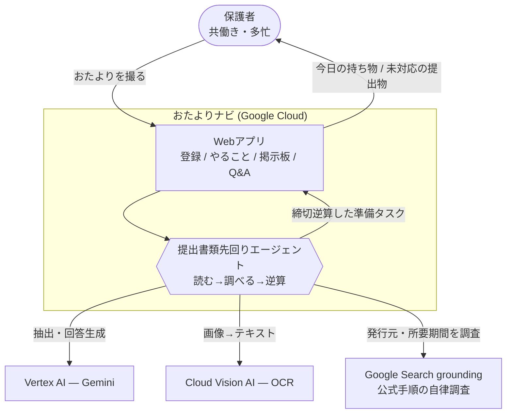
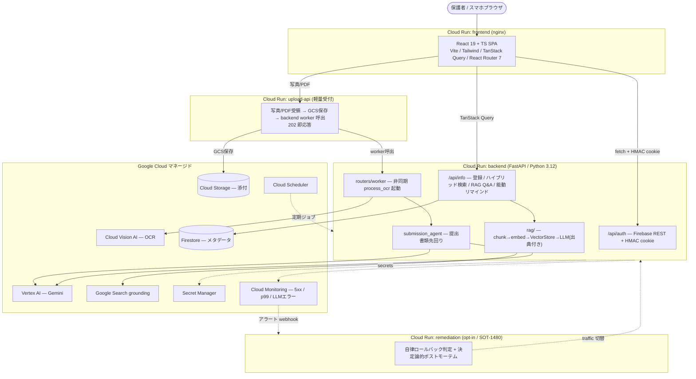
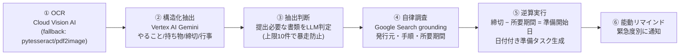
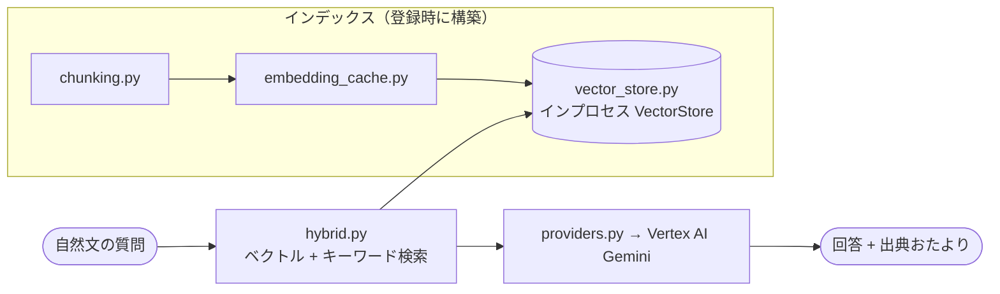
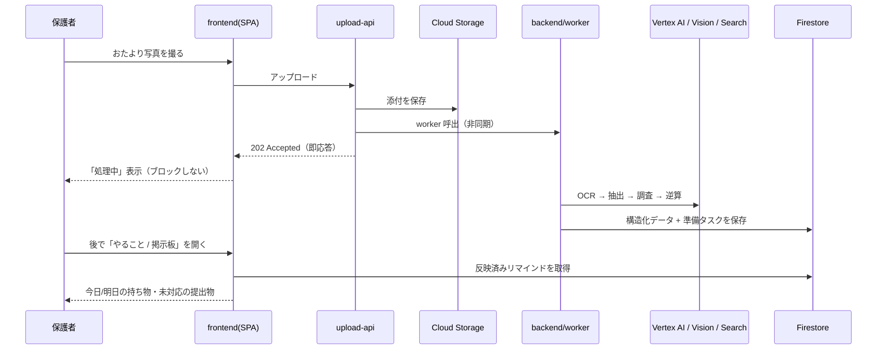
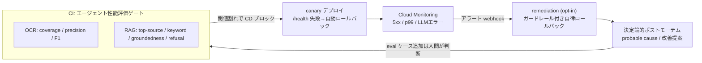
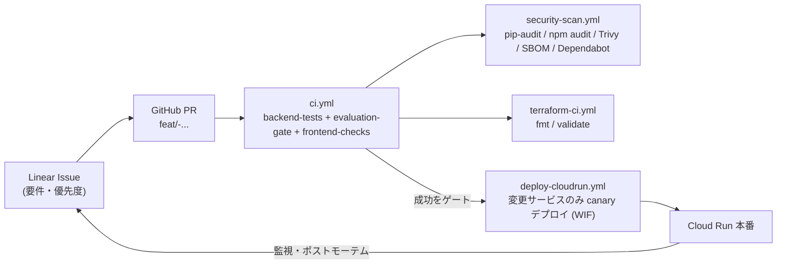

# システム構成 — おたよりナビ（toddler-private-rag）

> 本ドキュメントは「おたよりナビ」の**システム構成**を一枚で俯瞰するための設計資料です。
> 記載はすべて本リポジトリの実装（`README.md` / `backend/app/` / `backend/remediation_function/` /
> `infra/terraform/` / `.github/workflows/`）に基づく事実で、捏造はありません。実績数値・環境変数の
> 網羅表は [README](../README.md) を、設計判断の背景は [`docs/adr/`](./adr/) を正典として参照してください。
>
> **一行要約**: 保育園のおたよりを撮るだけで、AIエージェントが *OCR → 構造化 → 公式手順の自律調査 →
> 締切逆算のタスク生成* を一気通貫で実行する、Google Cloud 上のフルサイクル運用アプリです。

- 🚀 ライブデモ: <https://toddler-private-rag-frontend-iqrm6wvhfq-an.a.run.app/tasks>
- 🎥 紹介動画: <https://www.youtube.com/watch?v=yt0ke4QzjhE>

---

## 0. この構成が答える問い（審査基準との対応）

本作品は Findy DevOps AI Agent Hackathon への提出作品です。システム構成は次の観点を満たすよう設計・
推敲しています（詳細な「どこを見れば分かるか」は [§8 審査員別ガイド](#8-審査員別-どこを見れば分かるか)）。

| 審査基準 | 構成上の答え | 参照節 |
|---|---|---|
| ① AIエージェントが価値の中核か | *読む→調べる→逆算する* の多段判断を自律実行する提出書類先回りエージェントが中核。UI はその出力を映すだけ | [§3 エージェント](#3-中核-aiエージェントの自律ループ判断-タスク実行) |
| ② 課題へのアプローチ力 | 非構造・非デジタルな園情報を「撮るだけ」で構造化し、締切から逆算して先回り | [§1 全体像](#1-全体像-c4-context) |
| ③ ユーザビリティ | 非同期取り込みで UI は即応答。モバイルファースト SPA、出典付き Q&A | [§4 データ&制御フロー](#4-データ--制御フロー-リクエストのライフサイクル) |
| ④ 実用性・体験価値 | 締切逆算タスク自動生成＋緊急度別リマインドで提出漏れを未然防止 | [§3](#3-中核-aiエージェントの自律ループ判断-タスク実行) |
| ⑤ 実装力（技術選定の納得度・拡張性・実運用配慮） | Cloud Run 3サービス＋Vertex AI＋IaC＋評価ゲート＋自律ロールバックのフルサイクル | [§5 GCP](#5-google-cloud-構成マッピング) / [§6 MLOps](#6-mlops--障害対応ループ検知評価改善) / [§7 DevOps](#7-devops--開発生産性ループ) |

---

## 1. 全体像 (C4: Context)

「誰が・何のために・何を使うか」の最上位ビュー。中核は保護者ではなく **AIエージェント**が判断を代行する点です。

**課題**: 園からの情報（紙のおたより・掲示・行事表）は非構造・非デジタルで大量に届き、「この書類は勤務先
発行か」「発行に何日かかるか」「いつ準備を始めれば間に合うか」を保護者が毎回手作業で調べて逆算していました。
**提供価値**: 撮って登録するだけで、抽出・調査・逆算をエージェントが肩代わりし、提出漏れ・締切超過を未然に防ぎます。

---

## 2. コンテナ構成 (C4: Container)

実行基盤は **Cloud Run による 3 + 1 サービス構成**です。AI 重処理（`backend`）とアップロード受付
（`upload-api`）を分離し、アップロード体験をブロックしない実運用志向の非同期取り込みを実現しています。

| サービス | 役割 | 技術 | 定義 |
|---|---|---|---|
| `frontend` | SPA 配信 | nginx + Vite ビルド静的資産 | `frontend/Dockerfile` / `nginx.conf` / `infra/terraform/cloud_run.tf` |
| `upload-api` | アップロード即受領（202） | 軽量 FastAPI | `infra/terraform/cloud_run_upload.tf` |
| `backend` | 重処理（OCR / 抽出 / エージェント / RAG / 認証） | FastAPI + `google-genai` + `google-cloud-vision` | `backend/app/` / `cloud_run.tf` |
| `remediation` | ランタイム自律ロールバック + RCA（**既定 OFF**） | functions-framework（`backend/app` 非依存） | `backend/remediation_function/` / `remediation.tf` |

> `remediation` は `var.enable_autonomous_rollback = false`（既定）では**一切作成されず**、アラートは
> メール通知のみ。安全側デフォルトの opt-in サービスです（[§6](#6-mlops--障害対応ループ検知評価改善)）。

---

## 3. 中核: AIエージェントの自律ループ（判断・タスク実行）

**審査基準①への直接の答え**。中核は提出書類先回りエージェント（`backend/app/submission_agent.py`）で、
保護者が毎回行っていた「読む → 調べる → 逆算する」という**多段の判断**を自律的に実行します。単なる
LLM ラッパーやチャットではなく、*判断してタスクを生成し実行する*点に「AIエージェントである必然性」があります。

**実例（README §2.1 / `test_submission_agent.py` で検証済み）**: 「就労証明書を 2026/7/30 までに提出」の
1 行から、発行に約 2 週間かかる書類の**準備開始日（7/9）まで逆算**し、4 つの準備タスク（テンプレート入手 →
勤務先へ発行依頼 → 誤り確認 → 市町村へ提出）を自動生成。生成日付はテスト固定値と一致します
（`test_build_drafts_per_step_backward_chain`）。

**堅牢性の設計**: LLM / grounding 呼び出しは全て graceful に握りつぶし、失敗時は空リスト/None を返して
例外を伝播させません（never-throw 劣化、[ADR-0003](./adr/0003-never-throw-degradation.md)）。grounding が
使えない場合も LLM 既知知識へ graceful fallback します。

### RAG サブシステム（出典付き回答の内部基盤）

`backend/app/rag/` は自前実装のハイブリッド検索 + LLM 回答生成です（[ADR-0002](./adr/0002-custom-rag-implementation.md)）。

構成要素: `chunking`（分割）/ `embedding_cache`（埋め込みキャッシュ）/ `indexing`（索引構築）/
`hybrid`（ハイブリッド検索）/ `vector_store`（インプロセス格納）/ `providers`（LLM プロバイダ抽象）/
`service`（オーケストレーション）。空インデックス時は**出典なし＋拒否応答**を返す設計です（後述の eval refusal 指標）。

---

## 4. データ & 制御フロー（リクエストのライフサイクル）

**審査基準③④の裏付け**。UI をブロックしない非同期取り込みが体験価値の核です。

**主な画面**（`frontend/src/pages/`）: 掲示板/ホーム（`/`）・登録（`/create/auto`）・やること（`/tasks`）・
カレンダー（`/schedule`）・質問（`/info?tab=ask`, 出典付き RAG）・データ詳細（`/data/:id`）・設定・使い方。
日本語/英語切替と JST 統一の日付表示に対応。全画面が保護ルート（`ProtectedRoute`）配下です。

**データ分離**: メールから導出した owner 単位で情報を分離し、他ユーザーのデータに触れない設計
（`backend/app/identity.py`）。永続化は本番 Firestore + Cloud Storage、ローカル SQLite
（[ADR-0004](./adr/0004-firestore-sqlite-persistence.md) / `docs/persistence-architecture.md`）。

---

## 5. Google Cloud 構成マッピング

**審査基準⑤・審査員（佐藤一憲）への答え**。GCP は名目的でなく、実行基盤・AI・監視・自動処置まで実配線しています。

| レイヤ | 使用プロダクト | 実装/定義の根拠 |
|---|---|---|
| アプリ実行 | **Cloud Run ×3**（frontend / backend / upload-api）＋ opt-in remediation | `cloud_run.tf` / `cloud_run_upload.tf` / `remediation.tf` |
| AI（生成） | **Vertex AI — Gemini**（`google-genai`, `GOOGLE_GENAI_USE_VERTEXAI`） | `backend/app/ai_client.py` / `extraction.py` / `rag/providers.py` |
| AI（OCR） | **Cloud Vision AI** | `backend/app/ocr.py` |
| AI（調査） | **Google Search grounding** | `backend/app/submission_agent.py` |
| データ | **Firestore**（メタデータ）/ **Cloud Storage**（添付） | `firestore.tf` / `storage.tf` |
| 非同期 | **Pub/Sub** / **Cloud Scheduler**（定期ジョブ） | `pubsub.tf` / `scheduler.tf` |
| シークレット | **Secret Manager**（`--set-secrets` 注入） | `secrets.tf` |
| 監視 | **Cloud Monitoring**（アラート）/ ダッシュボード / SLO | `monitoring.tf` / `dashboard.tf` / `slo.tf` |
| コンテナ | **Artifact Registry** / Cloud Build | `artifact_registry.tf` |
| 認証（CI→GCP） | **Workload Identity Federation**（キーレス） | `wif.tf` / `iam.tf` |

> Terraform は state を **GCS リモートバックエンド**（`versions.tf` の `backend "gcs"`）で共有・永続化。
> ファイル数などの実績値は [README §6](../README.md) を正典とします。

---

## 6. MLOps / 障害対応ループ（検知・評価・改善）

**審査員（河合俊典）への答え**。「作って終わり」ではなく、**評価・監視・改善のループ**を構成に組み込んでいます。

- **評価ゲート**（`ci.yml` の `evaluation-gate`）— エージェントの精度回帰を**独立必須ステータス**に分離
  （`test_eval_ocr.py` / `test_eval_rag.py`, golden dataset は `backend/tests/eval/dataset.py`）。
  閾値割れで CI が落ち、**CD は CI 成功がゲート**なので本番デプロイもブロックされます。
- **障害対応サイクル**（検知 → 原因特定 → 処置 → 回復確認 → ポストモーテム, README §6）:
  - **検知**: Cloud Monitoring のアラート（5xx / p99 / LLM エラー）。
  - **原因特定**: remediation サービスがアラートを signal に分類し、確からしい原因・改善提案を
    **決定論的（ルールベース）**に自動生成（`remediation_function/postmortem.py` — 障害経路に生成 AI の
    幻覚を持ち込まない設計）。
  - **処置**: デプロイ時は canary 自動ロールバック、ランタイム時は opt-in の自律ロールバック。
    **自動ロールバックは更新（デプロイ）起因の 5xx / レイテンシ / LLM エラーに限定**、クライアント起因の
    **4xx は対象外**。監視の有効化と自動処置は**二段スイッチで分離**し、いずれも**既定 OFF**
    （`enable_autonomous_rollback = false` / `remediation_dry_run = true`）。
  - **回復確認 → ポストモーテム**: eval 回帰スイートが緑であることを確認して再デプロイ。恒久対応・再発防止
    （eval ケース追加）の意思決定と説明責任は**人間**が担う運用（`docs/runbook-operations.md` /
    `docs/runbook-rollback.md`）。

---

## 7. DevOps / 開発生産性ループ

**審査員（佐藤将高）への答え**。GitHub / Issue / CI/CD / 運用データと AI を結び、開発速度と品質を両立します。

- **CI**（`ci.yml`）— `backend-tests`（pytest + カバレッジゲート `--cov-fail-under=70`）/ `evaluation-gate` /
  `frontend-checks`（ESLint + typecheck/build + Playwright e2e）。
- **CD**（`deploy-cloudrun.yml`）— CI 成功を条件（`workflow_run`）に**変更のあったサービスのみ**を
  build → Artifact Registry → Cloud Run deploy。backend は **canary**（`--no-traffic --tag canary` →
  `/health` → 合格で 100% 昇格 / 失敗で旧リビジョン維持）。認証は **WIF**（JSON キーレス）。
- **IaC CI**（`terraform-ci.yml`）/ **サプライチェーン検査**（`security-scan.yml`: `pip-audit` /
  `npm audit` ブロッキング・Trivy・SBOM(CycloneDX)・Dependabot `cooldown` 付き自動更新）。
- **設計判断の記録** — 主要判断を [`docs/adr/`](./adr/) に ADR として記録（in-process エージェント /
  自前 RAG / never-throw 劣化 / Firestore+SQLite）。

> このループ自体が、本リポジトリを開発した AI ハーネス（Linear ↔ GitHub ↔ CI/CD）による**開発生産性の
> 実証**でもあります。Issue から PR・CI・デプロイ・監視・ポストモーテムまでが運用データで閉じています。

---

## 8. 審査員別: どこを見れば分かるか

| 審査員 | 評価軸 | 本構成での見どころ |
|---|---|---|
| 河合俊典 | ML/MLOps・技術的深さ・組織運用 | [§6](#6-mlops--障害対応ループ検知評価改善) 評価ゲート＋決定論的ポストモーテム、[ADR](./adr/) の「なぜその設計か」、never-throw 劣化 |
| 佐藤一憲 | GCP / Vertex AI / Gemini / 動くデモ | [§5](#5-google-cloud-構成マッピング) GCP 実配線マッピング、Cloud Run 3サービス、ライブデモ URL・動画 |
| 宮田大督 | AI×PdM・業務ワークフロー・社会実装 | [§1](#1-全体像-c4-context) 誰の業務がどう変わるか、[§4](#4-データ--制御フロー-リクエストのライフサイクル) 撮るだけ→先回りの体験、締切逆算の実例 |
| 佐藤将高 | 開発生産性・DevOps・組織改善 | [§7](#7-devops--開発生産性ループ) Issue↔PR↔CI/CD↔監視の閉ループ、canary + 自動ロールバック |

---

## 9. 関連ドキュメント

- [README](../README.md) — 実績数値・環境変数・セットアップの正典。
- [`docs/hackathon-submission.md`](./hackathon-submission.md) — 提出フォーム記入用テキスト。
- [`docs/persistence-architecture.md`](./persistence-architecture.md) — 永続化（Firestore / SQLite）詳細。
- [`docs/adr/`](./adr/) — 設計判断記録（ADR）。
- [`docs/runbook-operations.md`](./runbook-operations.md) / [`docs/runbook-rollback.md`](./runbook-rollback.md) — 運用・ロールバック手順。
